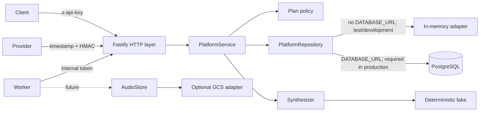

# Architecture

## Responsibilities

The API is a speech control plane, not a speech model. HTTP handlers validate transport contracts, `PlatformService` coordinates use cases, and `PlatformRepository` owns the transaction boundaries that protect cross-request invariants.



The adapters point inward toward interfaces. Fastify, the Google Cloud SDK, storage details, and the deterministic fake do not leak into the plan or lifecycle rules.

## Submission sequence

1. The API key is hashed and resolved to a tenant.
2. JSON Schema rejects unknown fields, unsupported voices/formats, oversized values, and malformed idempotency keys.
3. The service counts Unicode code points and applies the tenant's plan limits.
4. A canonical fingerprint is calculated from `text`, effective `voice`, and effective `format`.
5. `createJobWithReservation` executes one atomic repository operation:
   - replay a matching `(tenant, idempotency key)` record;
   - reject a key whose fingerprint differs;
   - verify `consumed + reserved + requested <= limit`;
   - insert the job, quota reservation, and idempotency record together.
6. The API returns `202`, `Location`, and an idempotency replay header.

The memory mutex gives those steps deterministic single-process atomicity. PostgreSQL first serializes the potentially absent `(tenant, key)` with a transaction-scoped advisory lock, then row-locks the usage bucket. This ordering makes retries and quota reservations correct across independent API replicas.

## State machine

```text
queued -----> processing -----> completed
   |               |
   |               +---------> failed
   |
   +-------------------------> cancelled

queued or processing -- signed provider callback --> completed|failed
```

- Only queued jobs can be claimed or cancelled.
- Cancellation is idempotent after the first successful cancellation.
- A completion consumes exactly one reservation.
- A failure or cancellation releases exactly one reservation.
- Terminal jobs reject a new callback event.
- A byte-for-byte equivalent event with the same event id replays the recorded result without accounting again.
- Reusing an event id with different semantic fields returns `409`.

Repository serialization also resolves process/cancel and callback/process races. One transition wins; the other observes a terminal or disallowed state.

## Failure semantics

Expected failures are `DomainError` values mapped to `application/problem+json`. The payload carries a stable `code` for callers and a request id for logs. Internal errors are logged and become a generic `500`; input text and secrets are not copied to the problem payload.

The deterministic processor claims before synthesis. A synthesizer exception is logged with job/tenant identifiers, while the public job receives a fixed safe failure message; its reservation is released. A failure during the repository completion transaction is not caught as a provider failure, preventing a second, invalid settlement attempt.

## Why asynchronous jobs

Real synthesis latency, retries, and provider limits should not hold a client connection open. A `202 + Location` contract permits an at-least-once queue/worker implementation later. The local internal route is only a deterministic way to exercise that worker boundary; it is not the intended public production worker protocol.
